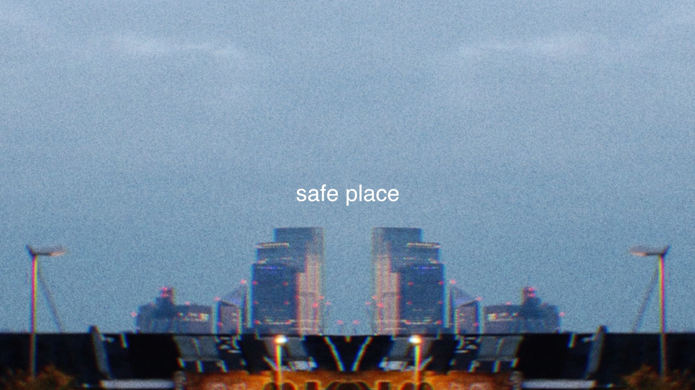

# Flynn Matthews Portfolio

A Portfolio website for Flynn Matthews showcasing his projects and work as an actor/director/producer/writer

## Adding content

So, you want to add something. Interesting.

### Project
1. Add your project picture to: `src/assets/content/blocks/projects`
2. Open `index.html`
3. Press Ctrl + F and find this line
```
<h1 class="text-4xl pt-10 pb-8 font-bold">PROJECTS</h1>
```
### Trailer
1. Add your trailer picture to: `src/assets/content/blocks/trailers`
2. Open `pages/trailers.html`
3. Press Ctrl + F and find this line
```
<h1 class="text-4xl pt-10 pb-8 font-bold">TRAILERS</h1>
```
### Adding to the page
4. If you scroll down a bit, You should see a list of repeating lines. You need to copy one of the chunks. It should look like this (This is a project card, a trailer one will look similar):


      <div class="overflow-hidden h-full w-full"> // This is a project "Card" you see on the website
        <a href="https://youtu.be/wKjT1zWUnTc"
           data-fancybox="iframe">
          <div class="group relative">
            <div class="block h-full w-full object-cover object-center animate-fade-in transition duration-500 transform scale-100 hover:scale-110">
              
              <!-- Overlay with play button -->
              <div class="absolute inset-0 flex items-center justify-center opacity-0 group-hover:opacity-100 transition duration-300">
                <svg class="h-16 w-16 text-black" fill="none" stroke="currentColor" viewBox="0 0 24 24" xmlns="http://www.w3.org/2000/svg">
                  <path stroke-linecap="round" stroke-linejoin="round" stroke-width="2" d="M5 3l14 9-14 9V3z"></path>
                </svg>
              </div>
            </div>
          </div>
        </a>
      </div>
5. Now that you've copied the code for a card to a notepad, you need to fill in the following with your new content

- `src=`: This is the location of your picture you added inside of `src/assets/content/blocks/(projects/trailer)`
- `href=`: This needs to be the YouTube link for your project. The user will be redirected to this when the click on the card.

6. Lastly, we need to add your new card to the website. Copy your edited card from step 5, and paste it where you want it to appear in the order. 
For example, if I wanted it to show in between the last two cards

          <div class="overflow-hidden h-full w-full">
            <a href="https://youtu.be/n4eRC0YsOlY"
               data-fancybox="iframe">
              <div class="group relative">
                <div class="block h-full w-full object-cover object-center animate-fade-in transition duration-500 transform scale-100 hover:scale-110">
                  
                  <!-- Overlay with play button -->
                  <div class="absolute inset-0 flex items-center justify-center opacity-0 group-hover:opacity-100 transition duration-300">
                    <svg class="h-16 w-16 text-black" fill="none" stroke="currentColor" viewBox="0 0 24 24" xmlns="http://www.w3.org/2000/svg">
                      <path stroke-linecap="round" stroke-linejoin="round" stroke-width="2" d="M5 3l14 9-14 9V3z"></path>
                    </svg>
                  </div>
                </div>
              </div>
            </a>
          </div>
          //// PASTE NEW CARD HERE
          <div class="overflow-hidden h-full w-full">
            <a href="https://youtu.be/wKjT1zWUnTc"
               data-fancybox="iframe">
              <div class="group relative">
                <div class="block h-full w-full object-cover object-center animate-fade-in transition duration-500 transform scale-100 hover:scale-110">
                  
                  <!-- Overlay with play button -->
                  <div class="absolute inset-0 flex items-center justify-center opacity-0 group-hover:opacity-100 transition duration-300">
                    <svg class="h-16 w-16 text-black" fill="none" stroke="currentColor" viewBox="0 0 24 24" xmlns="http://www.w3.org/2000/svg">
                      <path stroke-linecap="round" stroke-linejoin="round" stroke-width="2" d="M5 3l14 9-14 9V3z"></path>
                    </svg>
                  </div>
                </div>
              </div>
            </a>
          </div>
7. If you open `.html` in your browser, you should see your new project 🚀